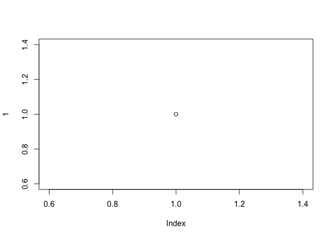

## R Markdown template for inhouse github documentation

This is an R Markdown document. Markdown is a simple formatting syntax
for that we most commonly use for authoring HTML, PDF, and MS Word
documents (for more details on using R Markdown see
<http://rmarkdown.rstudio.com>).

However, if you want to document your ideas and have that documentation
be the subject of detailed feedback from collaborators or supervisors,
then HTML, PDF or MS Word are not ideal formats because: 1) you can’t
comfortably read the rendered file on github 2) if you want to comment
the rendered doc, its a further step to link those comments or issues
back to the source code. [Wait, but can I proposed changes in the `.md` file then? How does that work?]

The ideal format would look more like your repo `Readme.md`, which
renders the formatting of headers, equations, hyperlinks, etc, for human
eyes right there in the repo. What normal markdown can’t deal with is
executing code and producing plots but using R Markdown you can specify
the output to produce a github-flavoured variant of markdown, including
code, plots, etc.

So how do we do it?

## Set the desired output format

The default output type for `.Rmd` files is `html-document`. Change
that. In the yaml header block specify that you want markdown, and then
further specify the variant as follows:

``` r
---
title: "documentation about an element of your work"
output: 
  md_document:
    variant: markdown_github
---
```

## The rest is automated

Once you make that change then the rest is taken care of.

``` r
item <- rlnorm(1)
```

When you click the **Knit** button a document will be generated that
includes both content as well as the output of any embedded R code
chunks within the document. You can embed an R code chunk like this:

You can also embed plots, for example:

## Including Plots

``` r
plot(1)
```



*μ* is mathematical notation

*β* ← *μ*≤

Note that the `echo = FALSE` parameter was added to the code chunk to
prevent printing of the R code that generated the plot.
